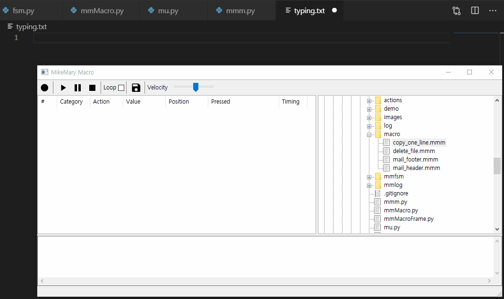

# MikeMary Macro
MikeMary Macro is a macro manager(recorder and player)

Record and Play macro(keyboard and mouse)
- Automate your boring works(input of keyboard and mouse)
- Save and Load your works
- Pause and Restart playing macro
- Set velocity of playing macro
- Set infinite repetition

GUI and CLI
- Select interface GUI or CLI


# Demo



# Package
- python (>= 3.7)
- wxPython
- pynput


# USE MickMary Macro

## Execute GUI
```shell
python mmm.py
```
To stop recording, move the mouse widly so that the mouse pointer moves more than 180.
To pause playing, press SCROLL LOCK key and to restart, press SCROLL LOCK key.
To stop playing before the end, press PAUSE BREAK key.
This works the same for CLI.

## Execute CLI
Record inputs of keyboard and mouse and Save it in macro/test.mmm
```shell
python mmm.py -cr -p macro/test.mmm
```

Load inputs from macro/test.mmm and Play it only once in default velocity
```shell
python mmm.py -cp -p macro/test.mmm
```
Load inputs from macro/test.mmm and Play it only once in velocity 4.4
```shell
python mmm.py -cp -p macro/test.mmm -v 4.4
```
Load inputs from macro/test.mmm and Play it infinitely in velocity 4.4
```shell
python mmm.py -cp -p macro/test.mmm -v 4.4 -l
```


# To Do
I would like to upgrade 
- To set shortcut to play macro
- To choose window(recording and playing macro in it) - I would like to use PyGetWindow(https://pypi.org/project/PyGetWindow/)
- To choose target(keyboard, mouse or both)


# ETC
At first, I coded FSM(Finite State Machine). Because I had learned it in digital system class, when I heard about FSM pattern I was very interested in and developed it. If you think of FSM, it has many advantages. For example, the flow of code is simple because the event and next state is restricted according to the current state and several people's working togerther is easy because each can code according to the state and event. Finally, I applied macro manager to FSM. That's MikeMary Macro.
